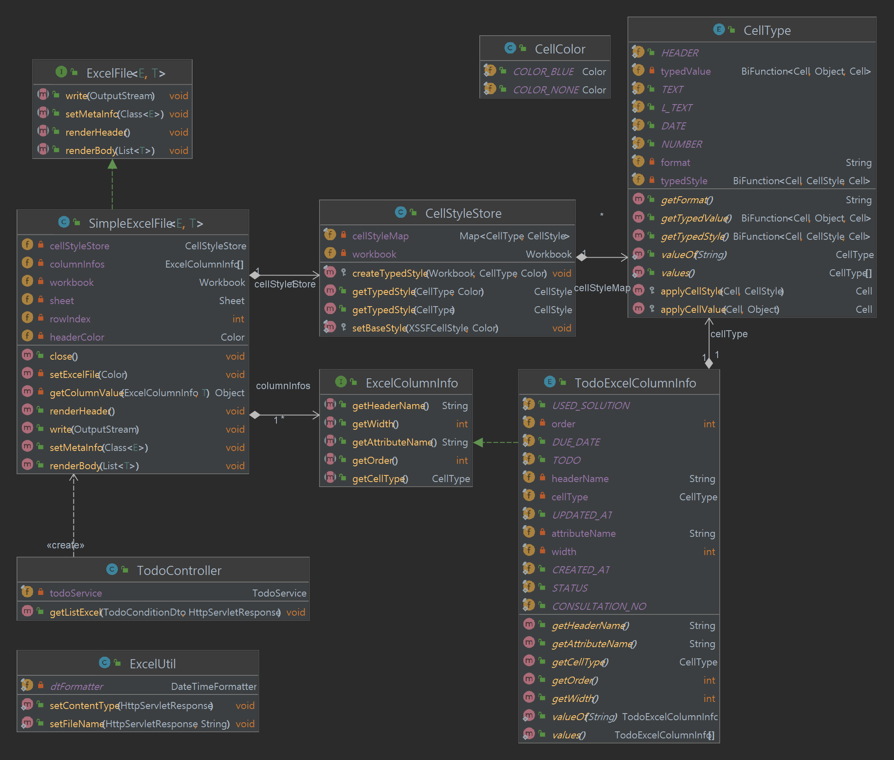

# 엑셀 다운로드 구현 예제
- 객체별 역할과 책임을 가능한 구분하도록 구현하였습니다.
- 리플렉션을 활용해 재사용성 높은 코드를 작성하고자 노력하였습니다. 
- 컬럼별 특성을 대표해줄 CellType Enum 구현하였습니다.
  - **Enum과 전략 패턴**을 활용해 재사용성 높은 셀 데이터 렌더링 로직을 갖도록 하였습니다.
- 참고 문서
  - [우아한 기술블로그 - 아 엑셀다운로드 개발,,, 쉽고 빠르게 하고 싶다 (feat. 엑셀 다운로드 모듈 개발기)](https://techblog.woowahan.com/2698/)
    - 엑셀 다운로드 구현과 관련하여 위 문서를 보고, 개발 요구사항에 따라 필요한 부분과 몇 가지 아이디어를 차용했습니다.

### 테스트 링크
- 로컬 실행시 http://localhost:8080/todo/excel
  - 엑셀 다운로드 기능 구현에 주안점을 둔 프로젝트로 api는 전체 데이터를 다운로드하는 것으로 간단히 구현하였습니다.

### 클래스 다이어그램

### CellType
- CellType이라는 이넘을 설정해두고, 이를 이용해 엑셀 스타일링을 수행하도록 구현하였습니다.
- ExcelColumnInfo 이넘 구현체 클래스에서 각 컬럼 정보가 CellType 데이터를 멤버로 갖습니다.

### ExcelColumnInfo
- 엑셀 파일을 만들 데이터의 메타 데이터 정보를 가진 이넘 클래스가 구현할 인터페이스입니다.
- 엑셀 파일을 작성하는 로직의 추상화를 위해 해당 인터페이스를 구현하게 됩니다.
  - 인터페이스의 메서드에서 확인할 수 있듯이 해당 인터페이스 구현체는 엑셀 파일에서 작성될 **헤더명, dto 클래스의 해당 컬럼 데이터의 속성명, 셀 타입, 순서, 너비 정보**를 갖게 됩니다.

### CellStyleStore
- CellType 별 스타일 객체를 캐싱 및 관리하는 객체입니다.
- 파일별로 생명주기를 갖도록 구현 (SimpleExcelFile에서 구상composition) 하였습니다.

### SimpleExcelFile<E, T>
- 제네릭을 활용해 작성된 엑셀 파일 작성 구현체입니다.
  - E 클래스는 ExcelColumnInfo 인터페이스를 구현한 이넘 클래스를 가리킵니다.
  - T 클래스는 엑셀로 작성된 데이터 DTO 클래스를 가리킵니다.
